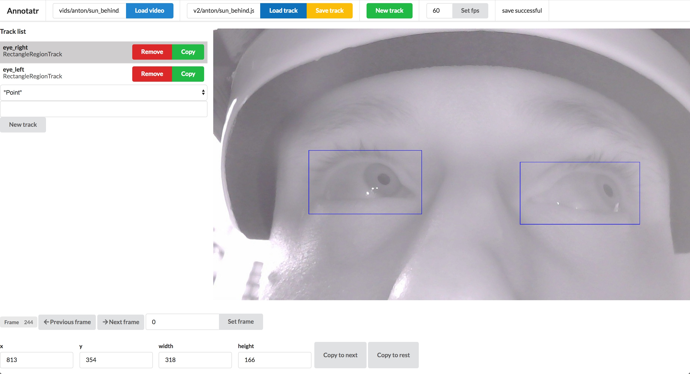

# Annotatr



Annotatr is a tool for creating geometric feature annotations for videos. It was created as part of a project about detecting eye features using deep neural networks and as such is still very much a work-in-progress. Right now the most important features are

* Loading/saving annotations to JSON-files
* Editing annotations using either the keyboard or direct input
* Each annotation is organised in "tracks" describing a specific property/feature for the duration of the video
* Currently points, ellipses, and rectangles are supported
* Basic copying functionality
* Easy fine-grained control of the video on a single-frame basis

# Quick start

## Installation
1. Clone this repository to your computer
2. Open a terminal and go to the 'client' directory
3. Run `npm install`
    1. Just accept default settings for Semantic UI
4. Cd into the semantic directory
5. Run `gulp build`

## Starting the application
1. Open a terminal in the 'client' directory and type `yarn start`
2. Open a terminal in the 'server' directory and type the following
    1. `export FLASK_APP=server.py`
    2. `flask run`
3. The application is now ready at localhost:3000


# Trackfiles
The editor uses so-called trackfiles for storing the annotations. It's just JSON and has the following form:
```json
{
    "length": 5000,
    "video_resolution": [720, 1280],
    "tracks": [
        {
            "name": "eye_left",
            "type": "inscribed_circle",
            "data": [
                
            ]
        }
    ]
}
```

# Doing more with your data
[Processing](https://github.com/antonmeskildsen/processing) is a data processing framework developed specifically for computer vision purposes. It supports a wide array of transformations on trackfiles as well as videos and images and is purpose-built for easy dataset creation.
